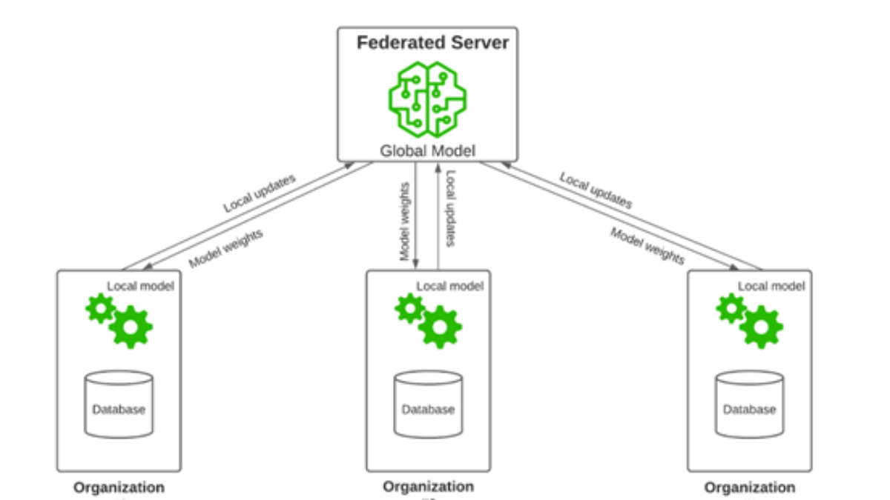
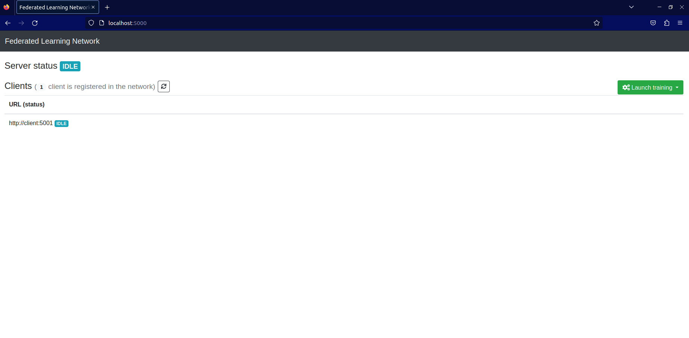
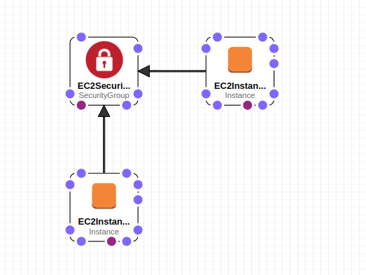
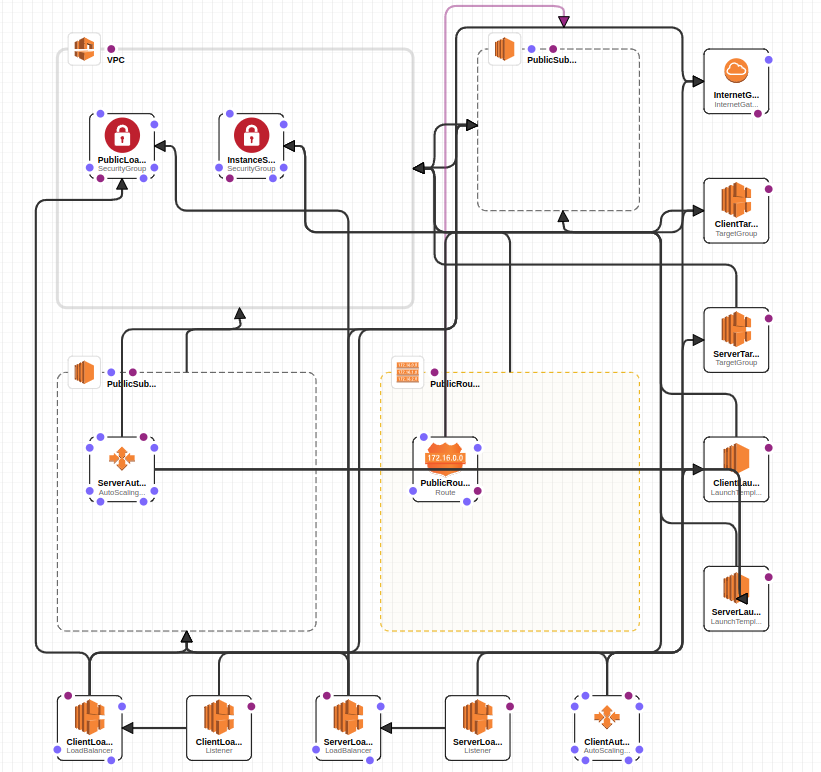

    # Deploying Federated Learning on Docker Containers Across Multiple Servers in AWS: A Step-by-Step Tutorial

Welcome to this tutorial on deploying a federated learning network application on 
Docker containers across different servers in AWS.

## Introduction

Federated learning is a machine learning technique that allows multiple parties to 
collaborate on training a machine learning model without sharing their raw data with
each other. This is achieved by training the model on a decentralized network of devices,
such as smartphones or IoT devices, where each device contributes its local data to 
the model without revealing it to other devices.

The key advantage of federated learning is that it preserves the privacy of each
participant's data while still allowing them to benefit from the collective knowledge
of the network. This is especially useful in scenarios where the data is sensitive, 
such as healthcare or finance, or where centralized data collection is impractical 
or impossible.

Docker, on the other hand, is a containerization technology that enables developers
to package their applications with all their dependencies into a portable unit called 
a container. Containers are lightweight, fast, and consistent across different 
environments, which makes them ideal for deploying and scaling applications in a 
variety of settings, including cloud computing platforms such as AWS.

By using Docker containers to deploy a federated learning application, you can ensure
that the application runs consistently and efficiently across different servers in AWS,
without worrying about compatibility issues or conflicts with other applications on the 
same servers. Additionally, Docker's isolation and security features help to ensure the 
privacy and security of the data and the application, which is especially important in
federated learning scenarios.


In this tutorial, we will guide you through the process of deploying a 
federated learning application on Docker containers running on multiple 
servers in AWS. The federated learning network application is 
already on a project in [this](https://github.com/eyp/federated-learning-network) 
GitHub repo. The architecture of the federated learning network to deploy is the following:

<p align="center">
  
</p>

In our case, both entities server and clients are going to run on Docker containers and
all the server and clients (Organizations on the image above) containers are running in separate
servers or instances. The steps (sections) to follow are the following:

1. **Clone** 
2. **Configure AWS**
3. **Run server and clients**
4. **Test and outputs**


You can deploy the application in the Docker containers in 3 different ways:

1)Set-up by yourself 
2)By using Cloudformation template
3)Deploying your client and server applications on AWS using Auto Scaling, Elastic Load Balancing, and separate EC2 instances for each Docker image.


## 1. Set-up locally 

### Install Docker 

Install Docker and Docker Compose: If you haven't installed Docker and Docker Compose on your machine, you need to install them. You can find the installation instructions for your platform at https://docs.docker.com/get-docker/ and https://docs.docker.com/compose/install/, respectively.

### Navigate docker-compose.yml

Navigate to the directory containing your docker-compose.yml file: Open your terminal and navigate to the directory that contains your docker-compose.yml file


### Create Network for Docker Containers
Run the following command to create the network:
```shell
docker network create common-net
```

### Run the Docker containers

You can run the Docker containers for your client and server applications by running the following command:
```shell
docker compose up -d --build
```


### Test your setup

<p align="center">
  
</p>
Once your Docker containers are up and running, you can test your setup by sending requests from the client container to the server container. You can use tools like Postman or curl to send requests and verify that they are processed correctly.You should be able to access your application by going to http://localhost:5000 in a web browser on your host machine.


## 2. By using Cloudformation template

Here we are going to use cloud_formation_simple.yaml

This CloudFormation script creates two EC2 instances, one for the client and one for the server. It installs Docker on both instances and runs Docker containers for your client and server applications, with the necessary ports exposed. It also creates a security group that allows incoming SSH, HTTP, and application-specific traffic.
<p align="center">
  
</p>


## 3. Deploying  client and server applications on AWS using Auto Scaling, Elastic Load Balancing, and separate EC2 instances for each Docker image


<p align="center">
  
</p>


Here we are going to use cloud_formation_complex.yaml


This .yaml script will create the following resources:

1. A VPC with two public subnets in different availability zones
2. An EC2 launch template for the server with the latest version of the arsbektas/fl-server:latest Docker image
3. An EC2 launch template for the client with the latest version of the arsbektas/fl-client:latest Docker image
4. An Auto Scaling group for the server with a minimum of 1 instance and a maximum of 3 instances access
5. An Auto Scaling group for the client with a minimum of 1 instance and a maximum of 3 instances
6. An Elastic Load Balancer for the server with a listener and a target group for the instances in the server Auto Scaling group
7. An Elastic Load Balancer for the client with a listener and a target group for the instances in the client Auto Scaling group
8. A security group for the instances that allows HTTP and SSH traffic
9. A security group for the load balancers that allows HTTP traffic

The outputs of the CloudFormation stack are the DNS names of the server and client load balancers, which can be used to access the Flask applications.
