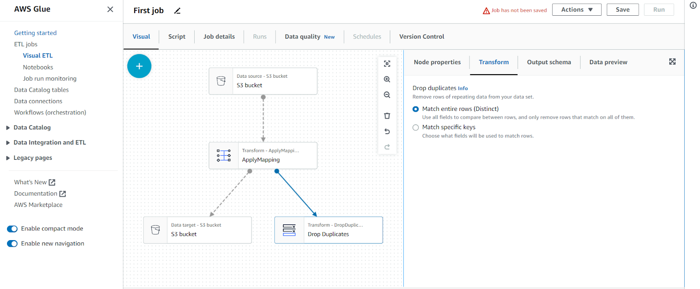

# RESEARCH TOPIC: Preprocessing scraping data using AWS Glue

## Scrapy
## AWS Glue

[AWS Glue](https://docs.aws.amazon.com/es_es/glue/latest/dg/what-is-glue.html) is a fully-managed extract, transform, and load ([ETL](https://aws.amazon.com/es/what-is/etl/)) service that makes it easy to move data between data stores. AWS Glue is built on top of Apache Spark, which allows it to handle large-scale, distributed data processing. This makes it well-suited for processing big data workloads. 

With AWS Glue, you can extract data from a variety of sources, transform it to meet your specific needs, and load it into a target data store. You can also use Glue to discover, catalog, and search for data stored in various data repositories, including Amazon S3, Amazon RDS and more. The main key components of this service are:

1. **Data Catalog**: Serves as a central metadata repository, providing a unified view of data assets across various sources.

2. **Crawlers**: Automatically scans and catalogs data from different sources, inferring schemas and populating the Data Catalog.

3. **ETL Jobs**: Enables data transformation and processing, using either Apache Spark code or visual ETL script builders. Extracts data, performs transformations, and loads it into target destinations.

4. **Dev Endpoints**: Offers an interactive development environment for creating, testing, and debugging AWS Glue ETL scripts.

For this laboratory we are going to create an AWS Glue job that reads the players.csv data, applying some basic ETL steps and stores the output data in parquet format. 

### 1. Create S3 buckets

Go to Amazon S3 >> Buckets >> Create bucket and create two S3 buckets with the following names:
*landing.zone.bucket*: bucket which will include raw data. 
*formatted.zone.bucket:* bucket which will include the output of the WS Glue job.

Locate the _players.csv_ file (file with the scraped data) and then upload it to the _landing.zone.bucket_ (select the bucket and select the upload option).

### 2. Create AWS Glue Job

After configuring the S3 Buckets, now we are going to create the AWS Glue Job which will have the _landing.zone.bucket_ and _formatted.zone.bucket_ as input and output endpoints respectively.

Go to AWS Glue >> ET jobs >> Visual ETL. In this site we can select how do we want to design our job (Visual, Python, Spark, Jupyter Notebooks…) and the source and target AWS storage system.
Create a job selecting the “Visual with source and target” option and the Amazon S3 for source and target (default configuration).

### 3. Endpoints configuration

After creating the job, we will be redirected to the visual editor where we can drag and drop ETL operations. 
- Name the job as “First job”
- In the Visual panel, select the source S3 bucket. In the right configuration panel, copy the players.csv URL in the S3 URL, select CSV as Data format and Comma(,) as Delimiter.

Select the target S3 bucket and configure it as follows:
- Format: Parquet (it is a columnar storage format designed to efficiently store and process large amounts of structured data).
- CompressionType: Snappy (it is a fast and efficient compression/ decompression library).
- S3 Target Location: “s3://formatted.zone.bucket/” 

### 4. Apply ETL 

AWS Glue facilitates the application of ETL on our data. For this tutorial, for simplicity, we are going to apply three basic preprocessing steps using the following Glue ETL tools in the visual editor (use the + button to add ETL tools):

- *ApplyMapping*: we can use it to convert the data features to different data types and select/drop features. Select _ApplyMapping_ and use the right configuration panel to convert all features to integer format except for the features Name, Rating and Country,

- **Drop Duplicates**: this tool drops the repeated rows in the data. It is useful to solve data redundancy in our CSV file. Select the option “Match entire rows (Distinct)”

- **UUID**: generates a unique identifier for each observation in the data. Name this new column names as “ID”.

- **Fill missing values**: this tool is used to impute the missing values of a specific feature by a specific value. In the panel configuration, select the column “Name” in the “Data field with missing values” and inset “Unknown” for the “Output data field name” field.

 > Besides the visual editor, AWS Glue also provides a programming interface using *Pyspark* and *Scala*. You can explore more in this [ETL programming guide](https://docs.aws.amazon.com/glue/latest/dg/aws-glue-programming.html )

Finally, select the target S3 bucket and in the “Node properties” panel select the Node parent as the UUID.

Now we have or job defines, but it is not saved. In order to save it, first we have to assign AIM Role for the job. To do that, go to the “Job details” panel and select an AIM role. Then save the job.

### 5. Run job 

The most commonly used options for running an AWS Glue job are:

- *On-Demand*: This option allows you to manually trigger a job execution as needed. You can start a job on demand using the AWS Management Console, AWS CLI, or AWS SDKs. It is often used for ad-hoc data processing tasks or one-time jobs.

- *Scheduled*: This option allows you to schedule job runs at specific times or intervals. You can define a cron expression or use a pre-configured schedule to specify when the job should run automatically. Scheduled jobs are useful for recurring data processing tasks that need to run on a regular basis, such as daily ETL operations.

We are going to run the job manually (on-Demand). Run the job by clicking  the “Run” button that appears on the right side and wait until it ends. In the “Job run monitoring” section, we can monitor our jobs' execution. If you check the _formatted.zone.bucket_ you will find the files generated by the AWS Glue job. 
