# Research Project on Cloud Visualization Approaches
***

#  Prerequisites of the Tutorial  
- Download the dataset which is going to be used during the tutorial, from this 
[link](https://www.kaggle.com/datasets/vishalvjoseph/weather-dataset-for-covid19-predictions). A copy of the dataset is 
saved in this repository, as well, for the purpose of this project and can be found here: [daily_weather_2020.csv](https://github.com/CCBDA-UPC/2023-research-4/blob/main/tutorial/daily_weather_2020.csv).
- Access AWS Management Console via [AWS Labs](https://www.awsacademy.com/vforcesite/LMS_Login), once the tutorial
is completed by using the `AWS Learner Lab`. If you have any issues accessing the Learner Lab you can use 
[Vocareum](https://labs.vocareum.com/home/login.php).

***

# Cloud Visualization

With the digital age there is a vast amount of information and data available that could be utilised to provide insights in the decision-making process, improve customer service, etc. The insights gained are not only used in business but also in other fields i.e. medicine, social media, weather etc. Their insights would not be meaningful if they are nor presented in terms that are understandable by the common user. With this in mind we need to find a visualization tool that allows us to understand the analysed data through advanced analytics and visual representations i.e. graphs, charts, maps etc.  

The goal of this project is to introduce different options on data visualization tools available on AWS, as well as to present the available functionalities and capabilities of AWS QuickSight.

There are different visualization tools in the market but this research is focused to those compatible with AWS. We take into account the following tools:

+ ***[Amazon Managed Grafana](https://aws.amazon.com/grafana/)*** is a fully managed service for open-source Grafana, a popular open-source analytics platform for querying, visualising, and understanding your metrics no matter where they are stored. Amazon Managed Grafana natively integrates with AWS data sources in your AWS account. You can choose from various pre-built visualisations to quickly start analysing metrics, logs, and traces without having to build a dashboard from scratch.

+ ***[Amazon QuickSight](https://aws.amazon.com/quicksight/)*** is a cloud-native serverless business intelligence service that provides data visuals, interactive dashboards, and data analytics powered by Machine Learning. You can use it to discover hidden insights from your data, perform accurate forecasting, and unlock new monetization opportunities. QuickSight uses ML to generate accurate responses to natural language questions about data.

+ ***[Domo](https://aws.amazon.com/marketplace/pp/prodview-2dpo7cttklctq)*** is the data experience platform that puts data to work for everyone, multiplying their impact through intuitive experiences and a secure foundation that connects across your data systems. 
Domo's integrated platform, hosted on AWS, includes 3 key components:
Data Foundation - Easy access to all your data with 1000+ pre-built cloud connectors drag and drop ETL and built in governance
BI & Analytics - Promote data literacy with real-time, self-service analytic, including embedded and extended analytics
Intelligent Apps - Enable intelligent action and automation through apps.

+ ***[Qlik Sense](https://aws.amazon.com/marketplace/pp/prodview-5h5um7r64pdgg)*** is a complete data analytics platform that sets the benchmark for a new generation of analytics. With its one-of-a-kind associative analytics engine, sophisticated AI, and scalable platform, you can empower everyone in your organisation to make better decisions daily, creating a truly data-driven enterprise.

+ ***[Jaspersoft](https://aws.amazon.com/marketplace/pp/prodview-2rym5fbrzlshy)*** for AWS Hourly is a reporting and analytics server built for AWS that can run standalone or be embedded in your application.
This business intelligence suite allows you to create and distribute beautiful, interactive reports, dashboards and data visualisations
Designed to quickly connect to your Amazon data sources, you can be analysing your data and building reports in under 10 minutes.
Deploy Jaspersoft as a single instance or a cluster via CloudFormation templates for scalability.

In order to select the most appropriate visualisation tool to represent patterns and insights included in the dataset provided, we can use the following criteria:
- Infrastructure support
- Connectivity
- Scalability
- Collaboration and interactive reporting
- Centralised security
- Self-Service
- Monitoring 

For that reason, it is concluded to introduce a tutorial on `Amazon QuickSight`.

***
# Amazon QuickSight
Before moving on to the tutorial's tasks, a theoretical introduction of `Amazon QuickSight` is taking place.

[AWS QuickSight](https://aws.amazon.com/quicksight/) is a business intelligence (BI) service provided by Amazon Web Services (AWS) that allows users to create interactive dashboards, perform ad hoc analysis, and generate reports. Here are some of its main capabilities:
- **Data source connectivity:** QuickSight connects to a wide variety of data sources including AWS data sources (e.g., Amazon Redshift, Amazon RDS, Amazon S3, Amazon Athena), third-party databases, on-premises data sources, and cloud-based applications such as Salesforce, Marketo, and ServiceNow.
- **Data preparation:** The platform offers built-in data preparation capabilities to help users clean, transform, and enhance their data. This includes features like auto-detection of data types, data profiling, and data validation.
- **Visualization:** A range of visualization options are provided, such as charts, tables, and maps to help users represent their data in the most meaningful way. Users can customize the look and feel of their visualizations, apply colour schemes, add branding, and more.
- **Collaboration:** Users can share their dashboards and insights with others within their organization. Users can also collaborate on dashboards, create teams, and manage access to data sources and dashboards.
- **Integration:** QuickSight integrates with other AWS services such as Amazon SageMaker, AWS Lambda, and AWS Glue to enable advanced analytics, machine learning, and data processing.
- **Mobile access:** A mobile app for iOS and Android devices is available, enabling users to access and interact with their dashboards on-the-go.
- **Security and compliance:** QuickSight offers a range of security and compliance features including data encryption, access controls, and auditing capabilities. QuickSight is also compliant with various regulatory frameworks such as HIPAA, PCI DSS, and SOC.  

Overall, AWS QuickSight is a powerful and flexible BI service that enables users to easily analyze and visualize their data, collaborate with others, and make informed decisions.

***
# Tasks
***
## Task 1: Access the AWS Management Console

At the top of [Learner Lab page](https://www.awsacademy.com/vforcesite/LMS_Login), choose `Start Lab` to launch a new lab instance. A Start Lab panel opens displaying the lab status. In the Start Lab dialog box that opens, note the AWS Region, as you will need to refer to it later in this lab.  

Wait until you see the message `Lab status: ready`, then click the `X` to close the Start Lab panel. 
At the top of this page, choose `AWS`. This will open the `AWS Management Console` in a new browser tab. The system will automatically log you in.  

**Tip**: If a new browser tab does not open, there will typically be a banner or icon at the top of your browser indicating that your browser is preventing the site from opening pop-up windows. Click on the banner or icon and choose `Allow pop-ups`.

## Task 2: Launch QuickSight Service
Once you have launched the AWS Management Console, in the search box type `QuickSight` and choose the appropriate service.
The specific service is not part of the free package, and for that reason you need to create an account by clicking on `Sign up for QuickSight`.  
as shown below.
<p align="center">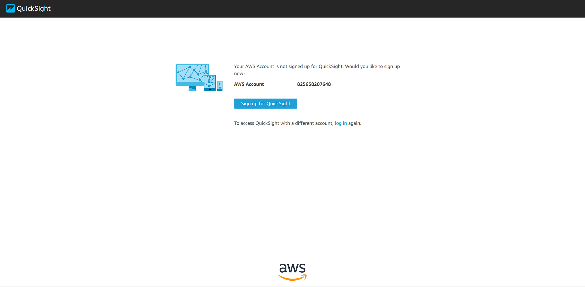</p>
  
To create an account you need to choose between two editions: 
- **Enterprise** and **Enterprise + Q** 

both of which have a 30-day free trial. Select the **Enterprise** edition for the purpose of this research.  
<p align="center">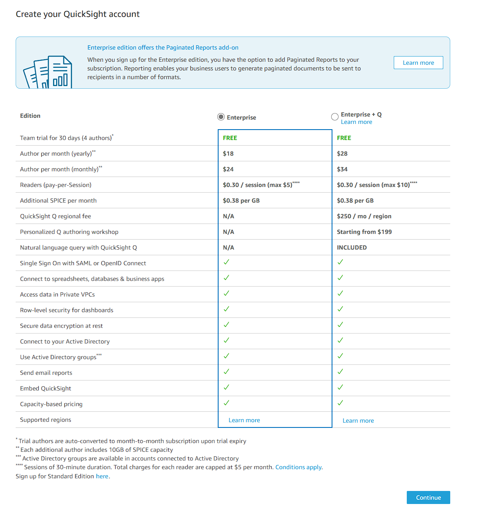</p>

Select `continue`. A new pop-up page will open as shown in the next figure.  
<p align="center">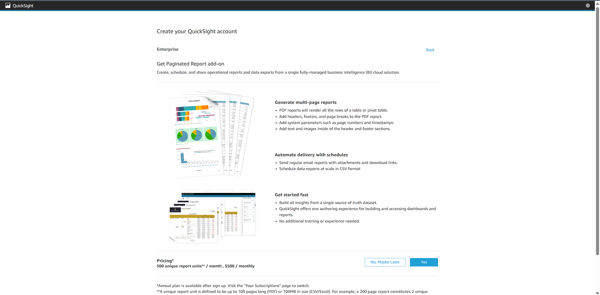</p>

Select the `No, Maybe Later`option. Ensure that you do not accept the add-ons as it would mean additional costs for the subscriptions. Add security information as shown below for completing the account creation. Ignore the IAM `warning` message presented on this page. This configuration also enables us to grant access to other AWS resources that collaborate with the AWS Quicksight.
<p align="center">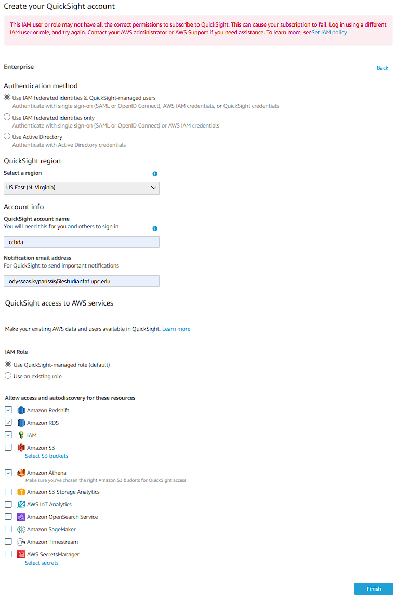</p>

Select `Finish`. A new pop-up page will appear that confirms the successful creation and configuration of a Quicksight account.    
<p align="center">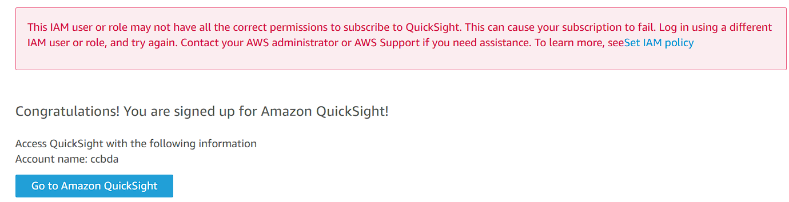</p>

To open QuickSight, choose `Go to Amazon QuickSight` which will launch the QuickSight start page.  
<p align="center"></p>
  
## Task 3: Upload and Preprocess the Dataset

On the Amazon QuickSight start page, choose **Datasets** tab that exists on the left side of the page.
On the `Datasets page`, a list of all the existing datasets is shown.  
<p align="center">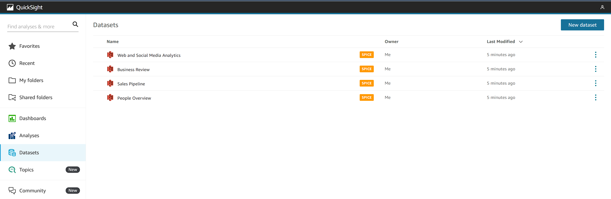</p>

In order to upload the dataset provided at the start of this document, choose `New dataset`. On the **New dataset page**, choose the `Upload a file` option.  
<p align="center">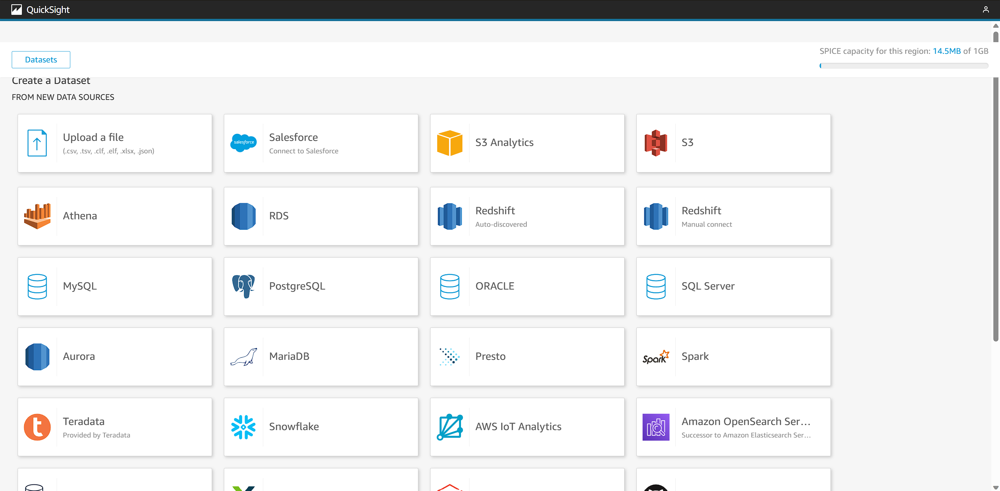</p>

Choose the CSV file `daily_weather_2020.csv` provided in the tutorial folder. Then, Amazon QuickSight opens the data preparation page. 
Click on the `Next` button.  
<p align="center">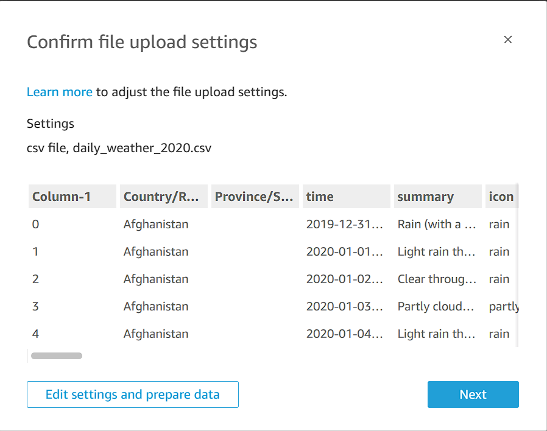</p>

The new presented page will provide a confirmation that data has been uploaded correctly, as shown below.  
<p align="center">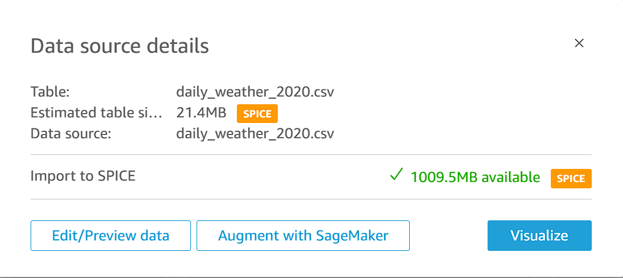</p>

Choose `Visualize` on the Data source details screen.  
Choosing Visualize brings you to a new page. You can skip those steps, for now, as we will first move on to preprocess the dataset, before visualizing it.
Thus, click on the QuickSight home button and navigate to the Quicksight `Datasets` tab by choosing the appropriate button on the left side of the page. 
A preview of existing datasets is listed including the uploaded csv for this exercise.  
<p align="center">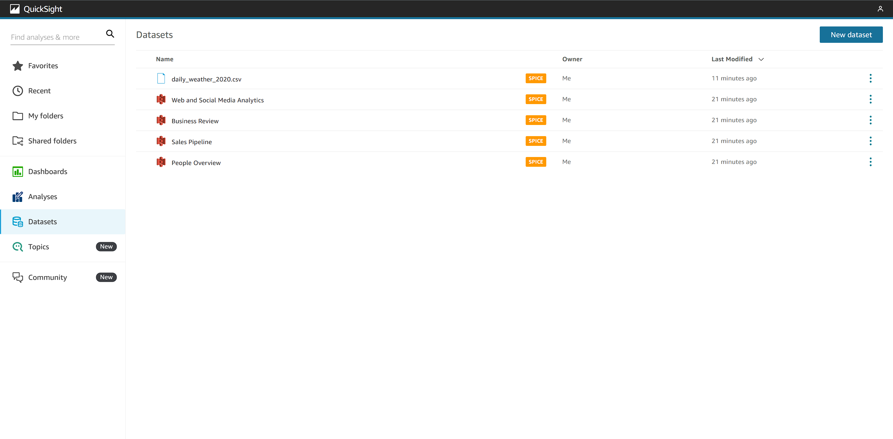</p>

On the Datasets page, choose the **daily_weather_2020.csv** dataset.  
<p align="center">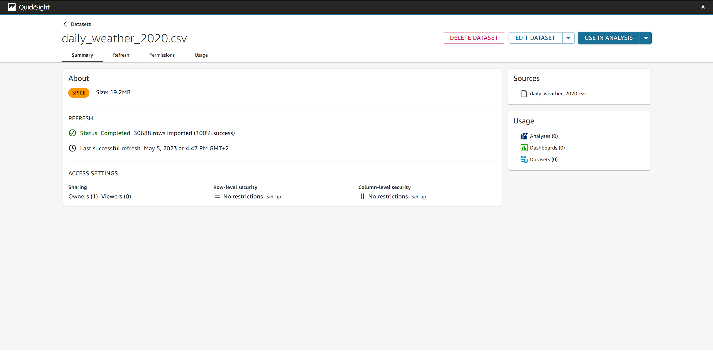</p>

Then select the `Use in Analysis` button at the upper right side of the page. A description of the dataset is going to be presented in the
generated page, as it can be seen in the following figure.  
<p align="center">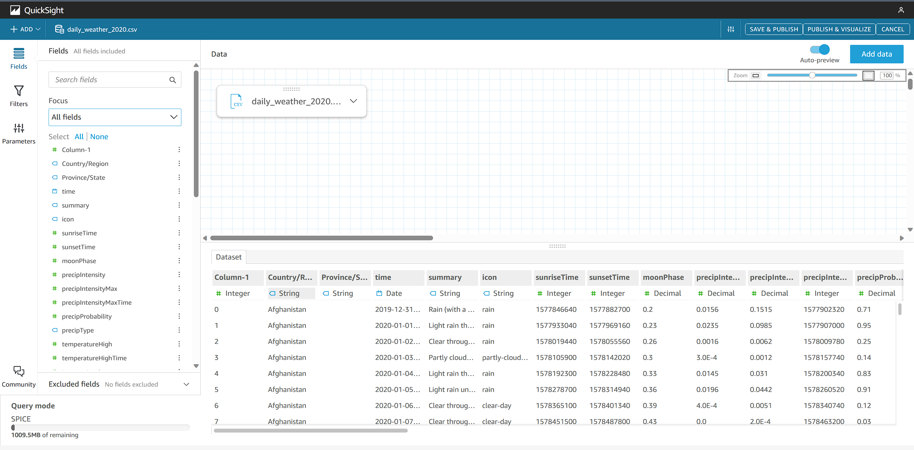</p>

In the Dataset preview pane, scroll to the country field which is of type `String` and change it to `Country` format.
<p align="center">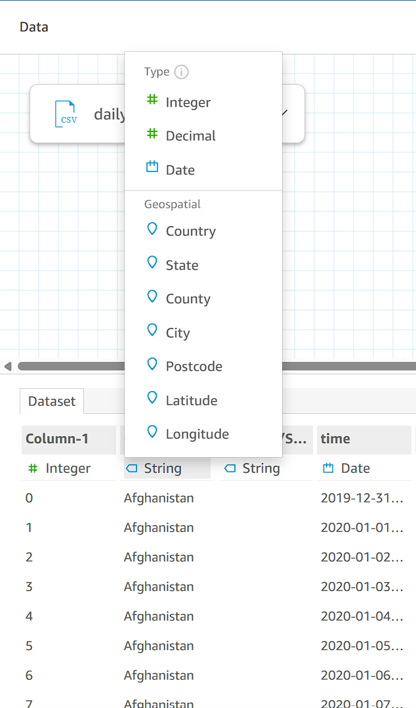</p>

In the same page, scroll to the right of the dataset's columns and transform the `Long` field format from `Integer` to `Longitude`, as presented here.
<p align="center">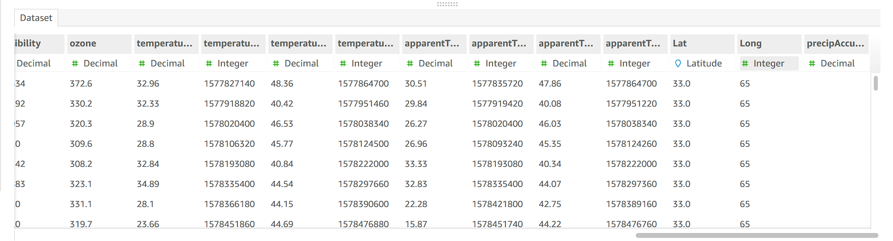</p>
<p align="center">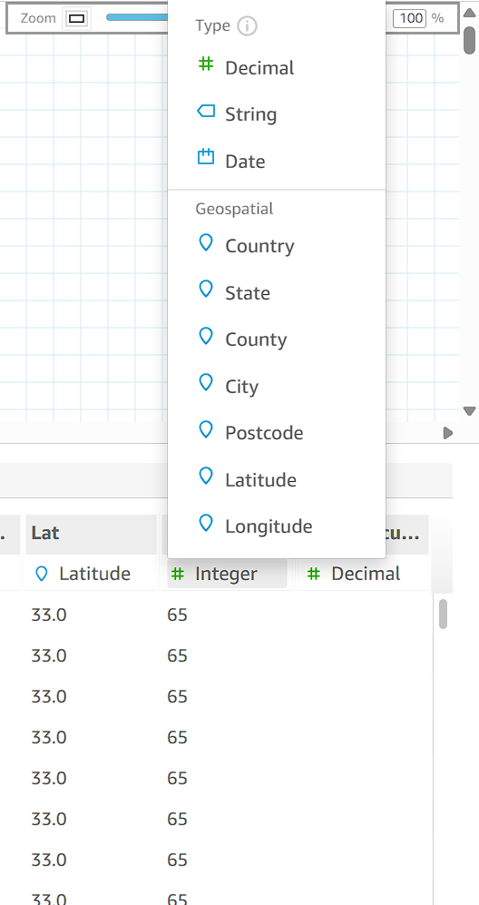</p>

Consequently, it can be seen that both the `Country` and the `Long` data types have been updated.    
Then, click on the `Save and Publish` button on the top right of the page in order to proceed.  

## Task 4: Generate a Visualization of the Analysed Data

On the Amazon QuickSight start page, choose the `Analyses` tab on the left side of the page. 
The Analysis page shows a preview of existing analysis.
<p align="center">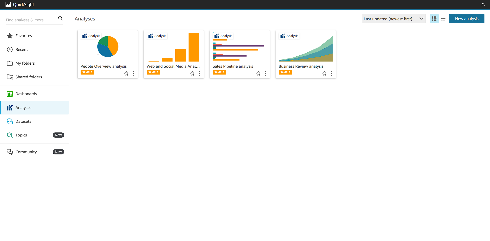</p>  

Select `New analysis`. A dataset is requested to perform the analysis on. Select the `daily_weather_2020.csv` dataset.   
<p align="center">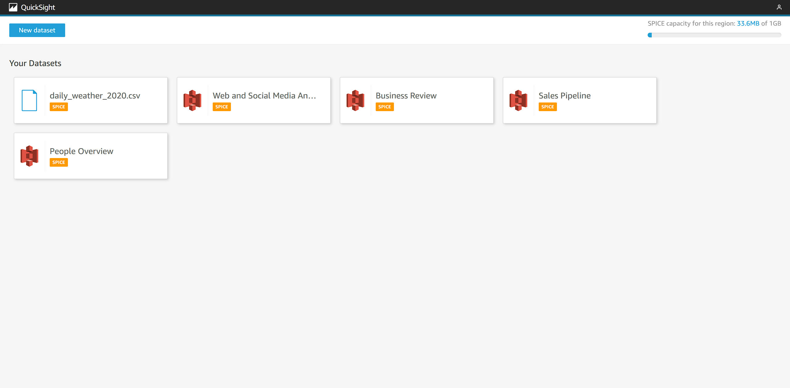</p>

Once selected and confirmed select `USE IN ANALYSIS`.  
<p align="center">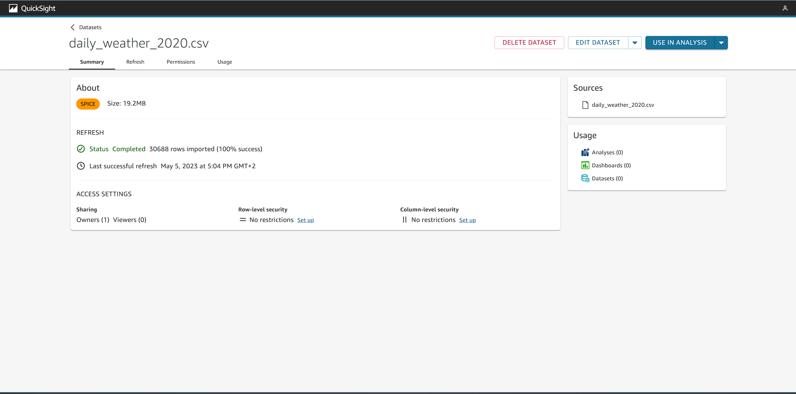</p>

Pop-up appears giving us an option of which type of report to use. We choose the interactive sheet that facilitates interactive reporting. Select `Create`.
<p align="center">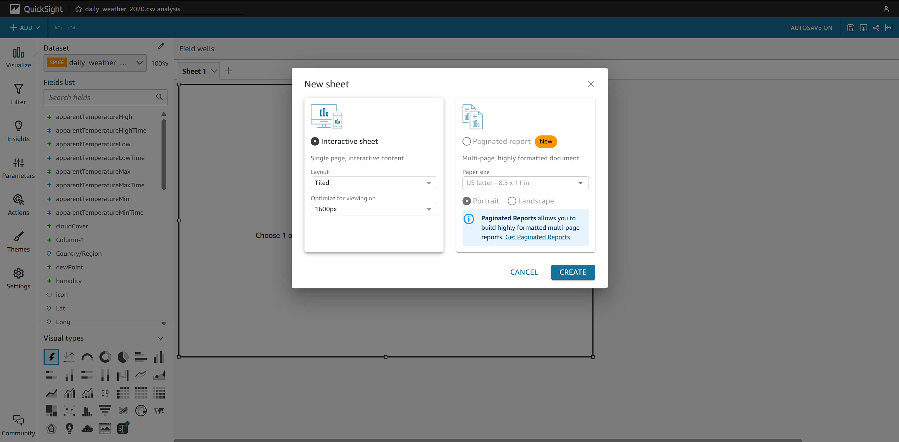</p>

## Task 5: Select the Visual Type

In this step, it is necessary to select a visual type for the graph we want to generate. As a next step, choose the `Filled map` icon.
<p align="center">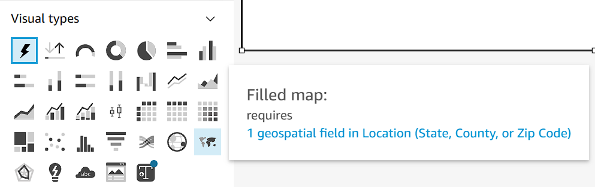</p>

Firstly, drag the `Country\Region` geographic field from the Fields list pane to the Location field. Then, drag `temperatureHigh` from the Fields list pane to the `Color` field.
A filled map appears with each location included in the dataset. Initially, for each country the sum aggregation of the values of `temperatureHigh` is presented.   
<p align="center">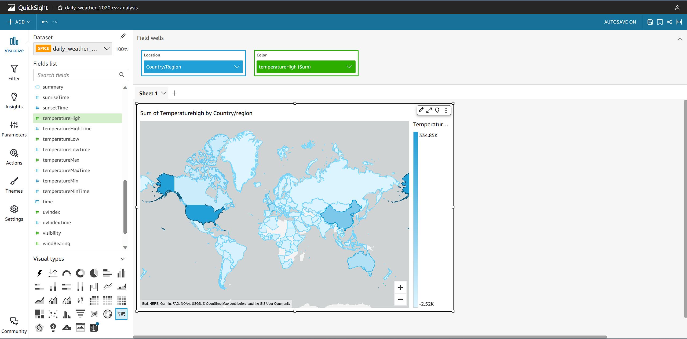</p>

Once the sum of the max temperatures does not make sense as an aggregation calculation, we want to change it to the average value.
In order to do so, expand the `Color` field pane by choosing the expand icon and there you can preview the parameters of the current measure, and the options available for the aggregation.
Change the aggregation of the field measure to show the average of temperatureHigh. 
<p align="center">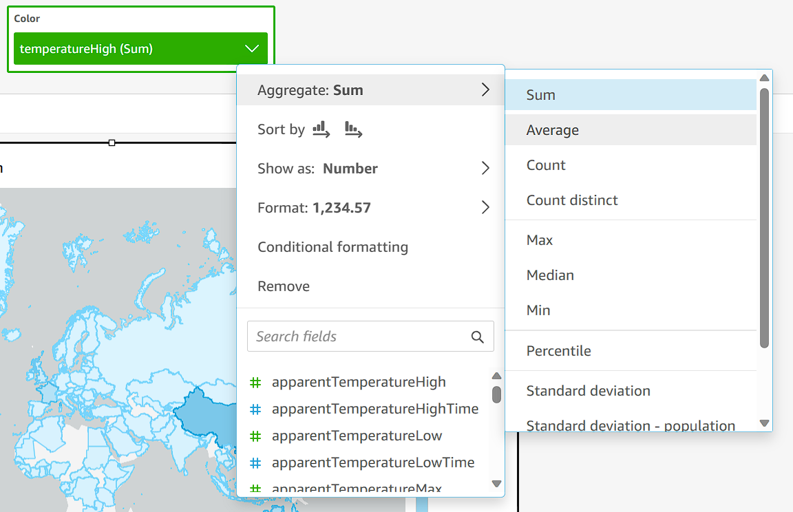</p>

Choose `Save as` to save the changes to the analysis.
<p align="center">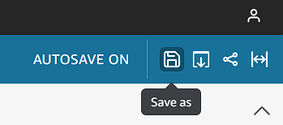</p>

Add a name to the analysis created.   
<p align="center">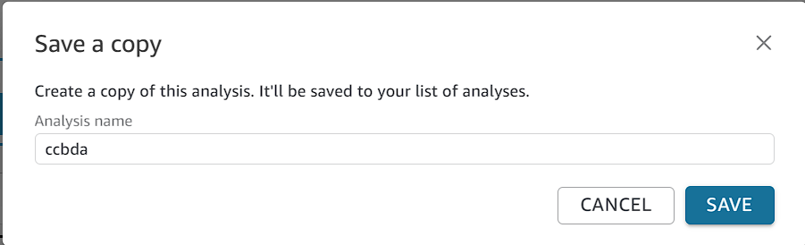</p>

Select `Save`. From the menu bar select `Add` and navigate to the `Add title` option, to add a title to the dashboard.  
<p align="center">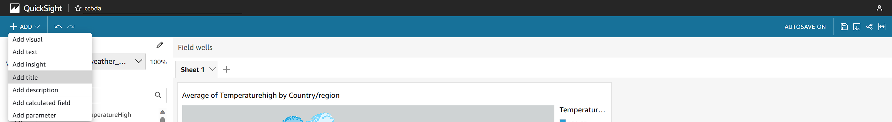</p>

Once saved you can preview the Dashboard created.  
<p align="center">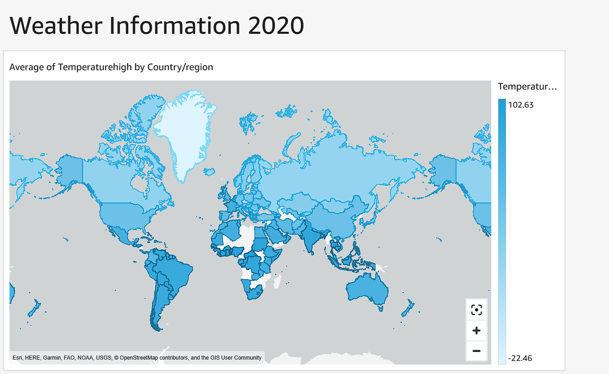</p>


### Task 5.1: Modify Visualizations by Adding a Filter

In this step, the inclusion of filter is introduced, in this way the user can take advantage of interactive visualizations.
In the analysis page, choose Filter at left and select `ADD FILTER`.  
<p align="center"></p>

A drop-down menu appears with a field list, as shown here.
Select and add the `time` field.  
<p align="center"></p>

Choose the new filter to expand it.
Configure the time filter by adding the properties of the field. Here you could choose from many Filter types and Conditions to create the needed filtering tool. In our case, as we want to select the data from a specific Date, we choose `Condition Equals`.
<p align="center"></p>

Select `Apply` to apply the filter. In the Fields pane, choose the field menu. Select `Add to sheet`to add the filter to the visualization.  
<p align="center"></p>

#### Task 5.1.1: Calculate a New Field from the Dataset  

What we will do now is use some of the tools we have available to modify our dataset in order to visualize the average Temperature (instead of the High one) in Celsius degrees.

On the data preparation page, scroll to the top of the Fields pane, and then choose edit dataset.  
<p align="center"></p>

Select the dataset and open the dataset menu (three dots).
Select the edit.
<p align="center"></p>

On the data preparation page, scroll to the top of the Fields pane, and then choose `Add calculated field`.  
<p align="center"></p>

Add an expression that define an average between high and low temperatures, and then transforms the average temperature from Fahrenheit to Celsius.
<p align="center"></p>

Select `PUBLISH & VISUALIZE`.  
<p align="center"></p>

Now, go back to the created analysis and update the map visualization with the new calculated field.  
<p align="center"></p>

### Task 5.2: Creating more Graphs for the Dashboard

#### Task 5.2.1: Pie Chart

On the analysis page, choose `Add`, and then choose `Add visual`.  
<p align="center"></p>


On the Visual types pane, choose the **Pie chart** icon.  
<p align="center"></p>


On the Fields list pane, drag the `Country` and `precipIntensity` fields to the appropriate sections (as shown in the following picture) and configure the aggregation by choosing the `Average` function.
With this, what we will see are the most rainy countries - countries with higher average of precipitation intensity using all the dates of our dataset -.
<p align="center"></p>


Publish the visual. We can see the top 20 most rainy countries.  
<p align="center"></p>

#### Task 5.2.2: Line Chart

We proceed to add a new visual, this time we will add a time series Line chart. As we did before, on the analysis page, choose `Add`, and then choose `Add visual`. On the Visual types pane, choose the **Line chart** icon. 

<p align="center"></p>


On the Fields list pane, choose the fields that you want to use.
Add a time field for the X axis and the temperature field in Celsius from the calculated field for Value.
We want to see an increase in temperature for a country over time.  
<p align="center"></p>


Create a new filter. Configure the country field by selecting a specific country to review.  
<p align="center"></p>

Choose `APPLY` and then choose on `ADD FILTER`. Add the filter to the sheet.  
<p align="center"></p>

#### Task 5.2.3: Bar Chart

We proceed to add a new visual, this time we will add a Bar Chart showing the average temperature in Celsius by Month for the selected country (selected using the previously created filter).
On the analysis page, choose `Add`, and then choose `Add visual`. On the Visual types pane, choose the `Bar chart` icon.  
<p align="center"></p>

From the Fields list pane, drag a time field to the X-axis field aggregated to a month level.
In addition, drag the calculated temperature to the Value field.  
<p align="center"></p>

Now select the previously created filter in section `Task 5.2.1` above (you might need to click on the Line Chart visual to do so).
<p align="center"></p>

Edit the filter again and change **Only this visual** to **Some visuals**. 
<p align="center"></p>

Select the option to apply the filter to other visuals and select the same filter for the Bar Chart and Line Chart visuals.  
<p align="center"></p>

### Task 6: Publish the Dashboard 

Publish the analysis as a dashboard to share insights with other users. In your analysis, choose `Share` in the application bar at upper right.    
<p align="center">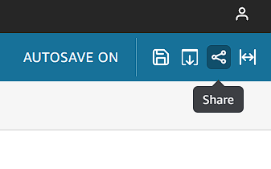</p>

Then choose `Publish dashboard`. 
<p align="center">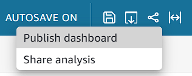</p>
 
Choose `Publish new dashboard as`, and enter the name of the new dashboard.  
<p align="center">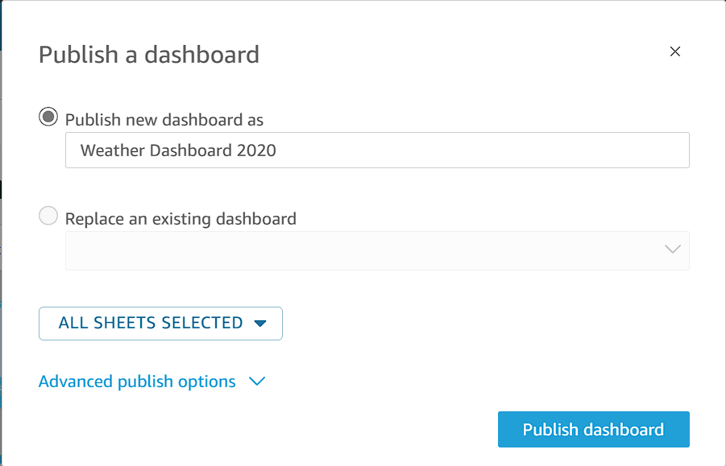</p>

Choose `Publish dashboard`. The dashboard is now published and can be found at the `Dashboards` tab of the service.   
<p align="center">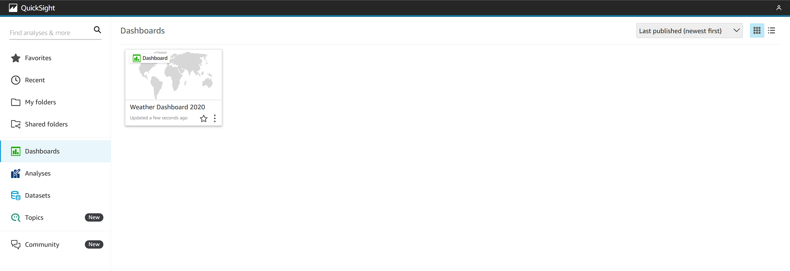</p>

Open the published dashboard. The dashboard consists of the four visual types created throughout the tutorial.  
<p align="center"></p>

# Use QuickSight's API with boto3

Once you have created the dashboard on QuickSight via the AWS Management Console, we are able to access to it
via the API services in order to use it programmatically, like in applications, etc..

In order to do so, you can use the following `Python` script:
```python
import boto3
import webbrowser

# Replace these values with your own
AWS_ACCESS_KEY_ID = 'YOUR_ACCESS_KEY_ID'
AWS_SECRET_ACCESS_KEY = 'YOUR_SECRET_ACCESS_KEY'
AWS_SESSION_TOKEN = 'YOUR_SESSION_TOKEN'

# Connect to AWS
session = boto3.Session(
    aws_access_key_id=AWS_ACCESS_KEY_ID,
    aws_secret_access_key=AWS_SECRET_ACCESS_KEY,
    aws_session_token=AWS_SESSION_TOKEN,
    region_name='us-east-1'  # Change this to your desired region
)

# Get the AWS account ID
sts_client = session.client('sts')
aws_account_id = sts_client.get_caller_identity().get('Account')

# Connect to QuickSight
quicksight = session.client('quicksight')

# Get list of dashboards
response = quicksight.list_dashboards(AwsAccountId=aws_account_id)

# Generate URL for each dashboard
for dashboard in response['DashboardSummaryList']:
    dashboard_id = dashboard['DashboardId']
    url = quicksight.get_dashboard_embed_url(
        AwsAccountId=aws_account_id,
        DashboardId=dashboard_id,
        IdentityType='IAM',
        SessionLifetimeInMinutes=60,
        UndoRedoDisabled=True
    )['EmbedUrl']

    # Open dashboard in browser
    webbrowser.open(url)
```
The above script, is a very simple implementation of getting access to the dashboards generated in AWS QuickSight
 Service, and opening them in an interaction mode in a Web Browser. The only thing that needs to be configured before 
executing the script is to set-up appropriately the `AWS Credentials` at the start of the file. For more details, go to 
the `Learner Lab` terminal and execute the following command:
```
cat $HOME/.aws/credentials
```
This execution will print in the terminal the following information:
```python
[default]
aws_access_key_id = <YOUR_ACCESS_KEY_ID>
aws_secret_access_key = <YOUR_SECRET_ACCESS_KEY>
aws_session_token = <YOUR_SESSION_TOKEN>
```
Copy the keys and the tokens provided to your script and then execute the python file. Once it is executed a Webpage 
containing the dashboard created must open in your Browser, as shown below:

<p align="center"></p>


<p align="center"></p>


**Q1**: What has been your personal experience regarding the subject?   
**Q2**: What lessons have you learned?  
