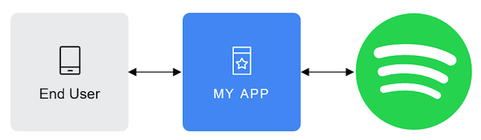

Build a Spotify-integrated App
======
Access a myriad of music-related information through the Spotify API and squeeze some insights into your music 
consumption.

## Introduction
Spotify's Web API is an incredibly rich and powerful API allows developers to create applications that can 
interact with Spotify's services, giving access to diverse metadata about content metadata, getting recommendations, 
creating and managing playlists, or controlling a Spotify user's playback directly through the API.

## Tutorial
This tutorial will show users how to gain access to Spotify's Web API and showcase some basic concepts 
behind Spotify for Developers (Spotify's platform for the development of application, websites, and services
with integrations with Spotify) and also some key elements and metadata that can be reached using the API.

### Getting started
#### The Spotify Developer Dashboard
First, we need to [sign up](https://www.spotify.com/es/signup) for a normal Spotify account.

-------

 

-------

Once we have created the account, we will need to register to the 
[Spotify Developer Dashboard](https://developer.spotify.com/dashboard). We will need to accept Spotify's
Terms for Developers. 

-------


-------

By doing so, we are associating our Spotify account to Spotify for Developers, and gaining access 
to our Developer Dashboard. This Dashboard is a quick view of all our created apps (none at the moment). 

-------


-------

#### Creating a Spotify App
In the Spotify for Developers cosmos, all authorization flows connecting our Web App to the Spotify API go
through an Spotify App. An Spotify App provides the `Client ID` and `Client Secret`, the key-pair used for 
authentication with the Spotify API.

To create an app, we must go to our Spotify Developer Dashboard and click on `Create App`. We must give our app
a name, an app description, our app's website's URL, and a redirect URI. The last two can be mock-ups for now. 

-------


-------

Once we have created the app, we can visualize some usage statistics in our Developer Dashboard, which are
of course 0 as of now.

-------


-------

If we go to the app's `Settings` on the top right, we can access the `Client ID` and `Client Secret` key-pair for 
authentication. 

-------


-------

#### Authentication
There are several important design elements to take into account when approaching authentication and authorization 
in the Spotify API. First of all, we must mention that the authentication and authorization protocols are based 
on OAuth 2.0.

##### Agents
We must understand that there are three agents in the authentication flow: 

-------



-------

* The *end user*: The Spotify user who will access the application and grant access to their data (protected
resources)
* The *application*: Our application will be a client that requests access to the protected resources once
the user has granted access.
* The *authentication server*: The Spotify API server which hosts the protected resources and provides authentication 
and authorization via OAuth 2.0

##### Scopes
When designing and developing our app, we must select one or several _scopes_ from the series of _scopes_ designed
by Spotify, which will determine to what user information our app will ask the user for access.

Scopes enable our application to access a given set of metadata or perform a set of actions on behalf of 
the user. We must design our application in a way that we require the minimum set of scopes possible to make 
it work, in order to guarantee the end user's data privacy and safety. The 
[scopes documentation](scopes documentation) of the Spotify API defines the available scopes and the information 
they grant access to.

##### Flow
Spotify implements the four grant types (or authorization flows) defined by the OAuth 2.0 to request and get 
an access token. These methods of authentication have different pro's and con's and the decision on which method
suits best our use case must take into account what type of application we are building. 

In our ongoing project, we are interested in obtaining user data and making some visualizations with it. This limits
the authorization flows that we can choose to two: the 
[Authorization Code Flow](https://developer.spotify.com/documentation/web-api/tutorials/code-flow) and
the [Authorization Code Flow with PKCE Extension](https://developer.spotify.com/documentation/web-api/tutorials/code-pkce-flow).

Of these two, the Authorization Code Flow is suitable for web and mobile apps where a user grants permission
only once and where the client secret can be safely stored. Because of the AWS infrastructure we have in mind, this
protocol suits us. 

The image below describes the Authentication Code Flow method.


1. Our app requests authorization to the Spotify Accounts Service, which in turn prompts the end user to log in through
the Spotify Log In, and then to authorize our app to access their data for the selected scopes.
2. Once authorized by the user, our application requests an access token to the Spotify Accounts Service. 
3. Once we have an access token, we can use it to make requests to Spotify's API and retrieve the user information that 
our app has access to thanks to the selected and accepted scopes.
4. Access tokens expire, so after a short time, our application must ask the Spotify Accounts Service for a refreshed 
token.


## Basic Demo WebApp

It is easy to set up simple data driven web applications to interact with your data, even using lighter frameworks than django or flask. For this simple demo we will explore [Streamlit](https://streamlit.io). Streamlit is an open-source Python library that makes it easy to create and share beautiful, custom web apps for machine learning and data science. 

It is very easy to create a simple webapp where users can interact with parameters that are used to execute your desired transformations and visualizations, such as the example below which connects to a users spotify account to retrieve their liked songs and allows the user to specify the number of their top songs used to perform clustering based on the songs' metadata (in this case - "danceability", "energy", "acousticness", "instrumentalness", and "valence")


The code used to run this demo is in the `app.py` script under the `streamlit` directory of this repo.

## Spotify API exploration

The Spotify API contains three main blocks of functions with
different functionalities:
- Retrieve metadata about Spotify content: tracks, albums, artists, shows, playlists...
In this tutorial we are focusing in this purpose of the API.
The available metadata is very diverse and includes, among others:
  - Artists: name of the artist, their popularity, number
  of followers, and principal music genres associated
  - Albums: name, release date, genres, artists, external url, and image cover
  - Songs or tracks: name, artists, album, track number, duration, and popularity
- Create and modify playlists, and get recommendations of new songs.
- The API allows to reproduce songs with the device where the app is running,
while controlling the buttons to pause the song that is being reproduced,
play, skip... This third functionality is out of the scope of our app. 

### Spotipy
We can use the Python package `spotipy` to connect to the Spotify API with Python.
To do that, first we need to install the library:
```
    $ pip install spotipy
```

Then in Python, we import the libraries and set up our credentials:
```
    import spotipy
    from spotipy.oauth2 import SpotifyOAuth
    
    scope = "user-library-read"
    cid = "YOUR CLIENT ID"
    secret = "YOUR SECRET"
    redirect_uri = "YOUR API REDIRECT URI" # "https://localhost:8080"
    spotify = spotipy.Spotify(auth_manager=SpotifyOAuth(scope=scope, client_id=cid, client_secret=secret, redirect_uri=redirect_uri))
```

With that, we can see the details of a given playlist by providing the playlist URI:
```
    playlist_URI = "37i9dQZF1DXb0AsvHMF4aM"
    playlist = spotify.playlist(playlist_URI)
    print("Playlist name: ", playlist['name'])
    print("Playlist owner: ", playlist['owner']['display_name'])
```

and also obtain some information about the songs contained in this playlist:
```
    n = 4 # number of tracks shown
    for track in sp.playlist_tracks(playlist_URI)["items"][0:n]:
        #Track URI
        track_uri = track["track"]["uri"]
        
        #Track name
        track_name = track["track"]["name"]
        track_pop = track["track"]["popularity"]
        print(track_name, f" (popularity: {track_pop})")
        
        #Main Artist
        artist_uri = track["track"]["artists"][0]["uri"]
        artist_info = sp.artist(artist_uri)
    
        artist_name = track["track"]["artists"][0]["name"]
        artist_pop = artist_info["popularity"]
        artist_genres = artist_info["genres"]
        print(artist_name, f" (popularity: {artist_pop})")
        print(artist_info['genres'])
        
        #Album
        album = track["track"]["album"]["name"]
        print("album: ", album)
        print("")
```

